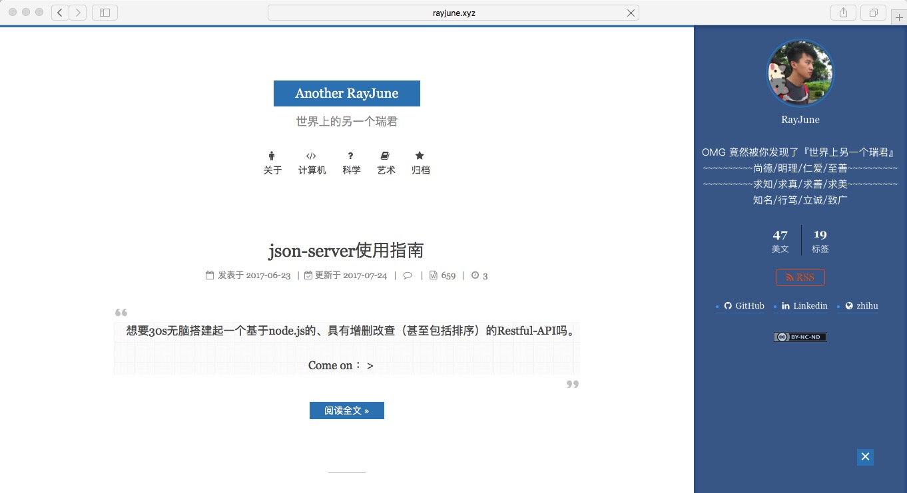
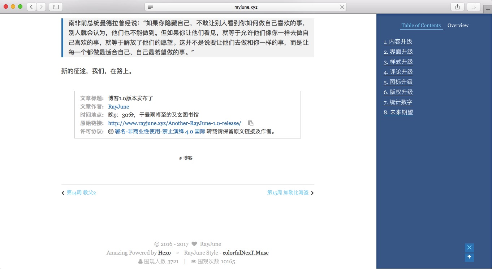
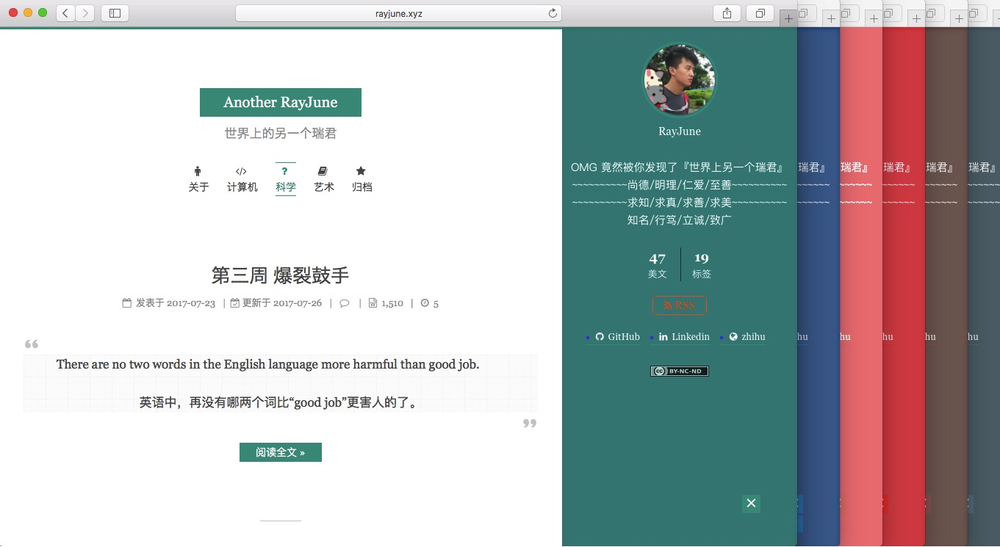

# colorfulNext

## 多彩的主题，多彩的你

## Colorful theme, colorful you

colorfulNext是一个基于hexo-theme-next的一站式优化解决方案，你可以用这份代码轻松配置 `多彩` 的next。

<a href="http://www.rayjune.xyz" target="_blank">在线预览 Preview</a> 

## 感谢声明

colorfulNext是基于iissnan的[hexo-theme-next](https://github.com/iissnan/hexo-theme-next)进行自定义个性化的主题，特别感谢hexo-theme-next的作者`iissnan`。

## 简单展示

### 认真，是精细到一个像素的雕琢

### 代码，是优美的艺术跃动于指尖

### 版权，是我们共同的支持与守护

### 多彩，属于你的主题，是你的色彩

## colorfulNext优化了什么

- [x] 统一全局色彩设计：分别以 `主色 / 亮主色 / 侧边色` 来展现，并提供  `blue / red / teal / pink / brown / blue-gray` 六种主题颜色设置方案
- [x] 无处不在的 `font-awsome` ：分别在博客文章开头以及footer增添icon图标（在footer方面需要你开启CNZZ统计功能），具体你可以参考博客源码
- [x] 字体优化：全局使用 `Georgia` 非衬线字体，并在每个地方的字体都 `适当增大px` ，增强阅读体验。
- [x] Markdown样式优化：分别对 `blockquote / h123456/ a /  / code` 进行样式进一步美化，并在部分区域用 `主色` 来强调整体色调。
- [x] 其他：增加每篇文章 `版权声明` ，优化侧边栏的 `头像展示` 并添加:hover旋转效果，增加brand以及优化主业中的button的hover`动画`效果。
- [ ] 针对Mist、Pisces进行样式优化
- [ ] 增加font-icon：linecons
- [ ] 增加繁体/英文转换功能
 
## 如何使用

下载这份代码到你的hexo-theme文件夹中即可（并在该文件夹中输入命令 npm i），并在你的hexo文件夹中的config选择主题样式为:  theme: colorfulNext 即可

其他拓展设置方面同NexT主题，[NexT主题拓展使用文档](http://theme-next.iissnan.com/theme-settings.html)

注意：现在`colorfulNext alpha 1/3`版本只优化了Muse这一个scheme，最好不要选择其他的scheme。

## 再次感谢

再次感谢`iissnan`以及广大的`开源geek`，colorfulNext在制作中同样使用了开源解决方案，由于时间久远忘记了来源，你可以发一个pull-Request来提醒RayJune哪段代码的来源，我会一并放在这里进行`致谢`。

Hope you enjoy your color ：）

### 版权声明

colorfulNext采用MIT协议。如果你要想提交修改建议欢迎来发Pull-Request。

