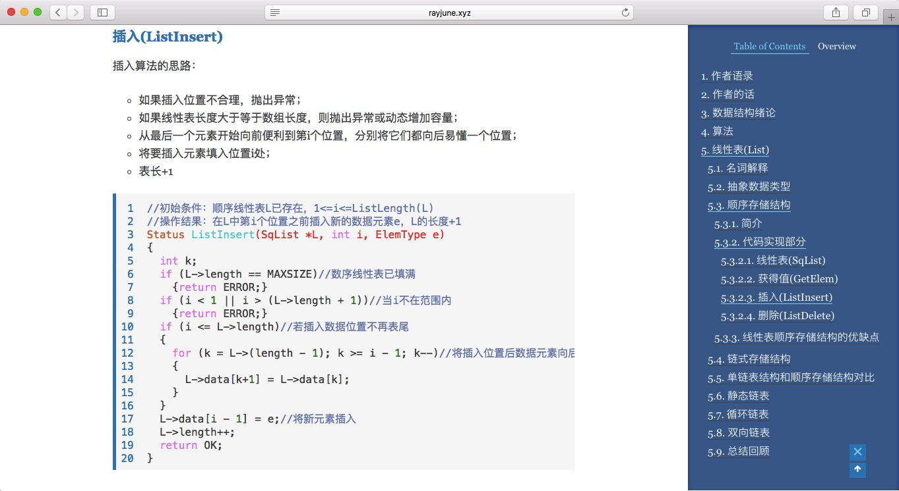

# colorfulNext

## 多彩的主题，多彩的你

## Colorful theme, colorful you

<a href="http://www.rayjune.xyz" target="_blank">在线预览 Preview</a> 

## 感谢声明

colorfulNext是基于iissnan的[hexo-theme-next](https://github.com/iissnan/hexo-theme-next)进行自定义个性化的主题，特别感谢hexo-theme-next的作者`iissnan`。

### 认真，是精细到一个像素的雕琢

### 代码，是优美的艺术跃动于指尖

### 版权，是我们共同的支持与守护

### 多彩，属于你的主题，是你的色彩

### 再次感谢

再次感谢`iissnan`以及广大的`开源geek`，colorfulNext在制作中同样使用了开源解决方案，由于时间久远忘记了来源，你可以发一个pull-Request来提醒RayJune哪段代码的来源，我会一并放在这里进行`致谢`。

>Hope you enjoy your color ：）

### 版权声明

colorfulNext采用GPL协议，即你可以：

* 可自由复制

你可以将软件复制到你的电脑，你客户的电脑，或者任何地方。复制份数没有任何限制。

* 可自由分发

在你的网站提供下载，拷贝到U盘送人，或者将源代码打印出来从窗户扔出去（环保起见，请别这样做）。

* 可以用来盈利
你可以在分发软件的时候收费，但你必须在收费前向你的客户提供该软件的 GNU GPL 许可协议，以便让他们知道，他们可以从别的渠道免费得到这份软件，以及你收费的理由。

* 可自由修改

如果你想添加或删除某个功能，没问题，如果你想在别的项目中使用部分代码，也没问题，唯一的要求是，使用了这段代码的项目也必须使用 GPL 协议。

